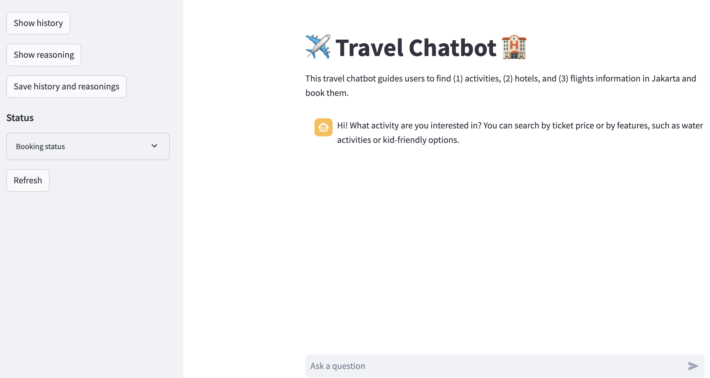
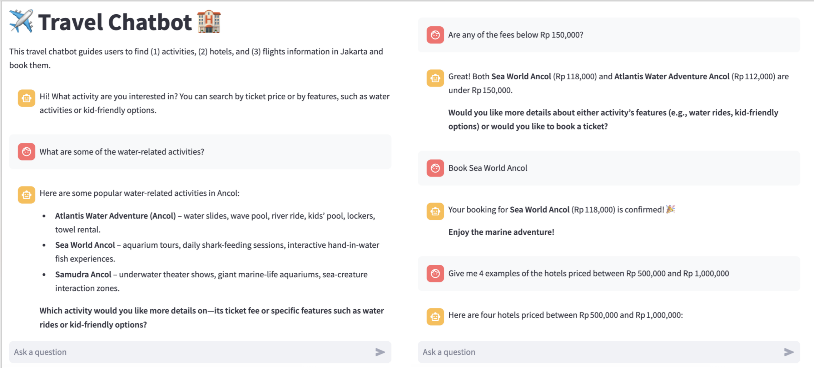
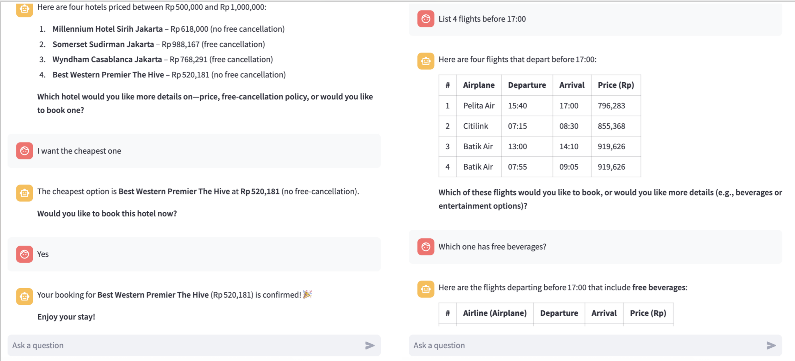
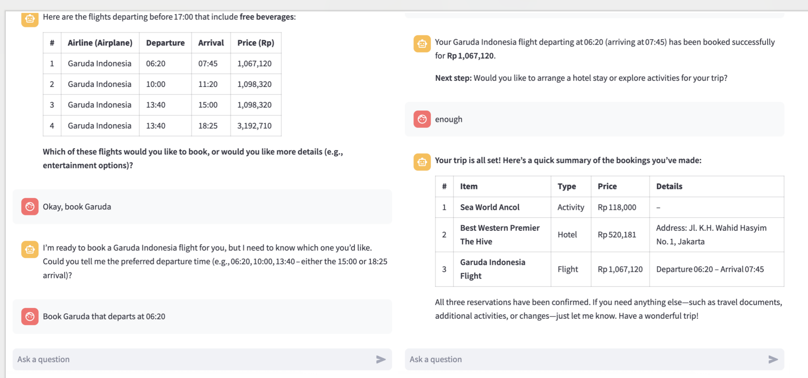
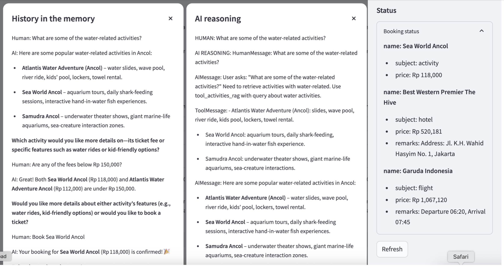

# 🛏️ AI Travel Chatbot

This application is an AI-powered travel assistant that helps users search for and book (1) activities, (2) hotels, and (3) flights directly through a conversational interface.

The chatbot leverages Large Language Models (LLMs), such as OpenAI GPT, to understand user intent, generate responses, and coordinate tool usage.

It also maintains conversational memory, enabling it to connect current questions with previous interactions for a more contextual and personalized experience.

To find the demonstration video, [clik here](screenshots/chatbot_demo.mp4) ▶️.

 

## 🧰 Tools

An AI agent orchestrates four integrated tools to fulfill user requests:

- 1️⃣ Custom Knowledge (RAG)  
A Retrieval-Augmented Generation (RAG) system that processes user messages and retrieves relevant 'activity' information.
The knowledge base includes destinations such as Taman Mini Indonesia Indah and Dufan Ancol, along with ticket prices and descriptions.

- 2️⃣ SQL Generator  
Converts user requests related to hotels or flights into executable SQL queries.

- 3️⃣ SQL Execution  
Executes generated SQL queries and returns structured results from three database tables:

    - hotels: address, price, and free cancellation availability

    - flight_schedules: price, departure time, and arrival time

    - flights: airline name, beverages, and entertainment availability

- 4️⃣ Booking Tool  
Records confirmed bookings, including selected items and their prices, once the user approves the reservation.

 

## 🧠 AI Reasoning

The AI agent is capable of planning, reasoning, and autonomously selecting the appropriate tools to complete tasks.

Its internal decision-making process can be inspected via the "Show Reasoning" button in the sidebar.

 

## 💬 Demonstration

The main interface guides users to describe their desired activities, hotels, or flights.

 

The following screenshots illustrate how the chatbot refines user preferences and assists in completing bookings:

 

When users confirm their interest, the chatbot records the booking and displays it in the sidebar under "Status".
Click "Refresh" to display all confirmed bookings.

The "Show History" and "Show Reasoning" buttons reveal detailed conversation logs and agent reasoning steps, which are saved in "screenshots/history_memory_.text" and "screenshots/reasonings_.text".

 

# 🏃‍➡️ How to Run the App

1. Run the user interface `streamlit run app.py`.
2. Run the backend `python api.py`.
